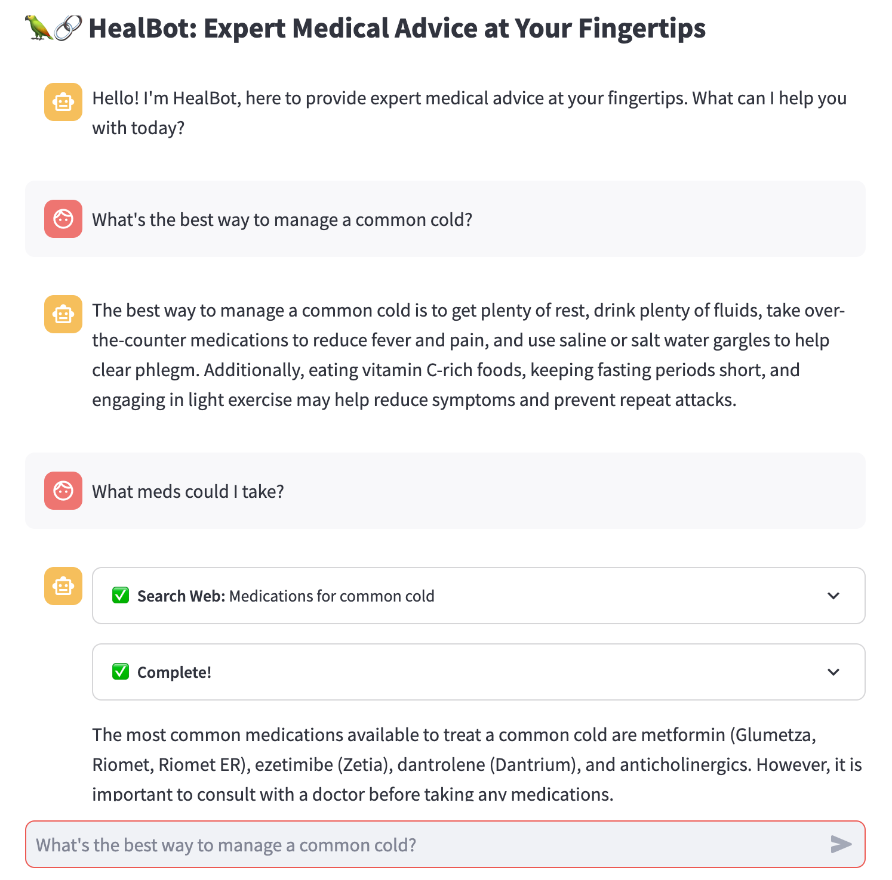

# HealBot: Expert Medical Advice at Your Fingertips

HealBot is a virtual medical assistant designed to provide accurate and compassionate medical advice. Utilizing the power of AI and a curated set of medical information sources, HealBot can answer a wide range of health-related questions, guiding users with professional insights.

## Features

- **Empathetic Medical Guidance**: HealBot answers medical questions in the manner of a compassionate healthcare professional.
- **Web Search Integration**: Utilizes search engines to fetch relevant medical information from trusted sources like [Healthline](https://www.healthline.com/) and [WebMD](https://www.webmd.com/).
- **Interactive Chat Interface**: Engages users through an intuitive chat interface, offering a seamless experience.
- **Flexible Query Handling**: Adapts to various health-related inquiries and provides detailed responses.

## How to Use

1. **Ask a Question**: Simply type your health-related question into the chat input box.
2. **Receive Guidance**: HealBot will process your query and provide a thoughtful response, sometimes including information fetched from the web.
3. **Follow Up**: If necessary, you can ask follow-up questions or seek clarification on the provided information.

## Technology Stack

- **Language Model**: OpenAI's GPT-3.5
- **Web Framework**: Streamlit
- **Search Integration**: DuckDuckGo Search API
- **LLM Framework**: LangChain

# License

HealBot is licensed under the MIT License. See the [LICENSE.md](LICENSE.md) file for details.
